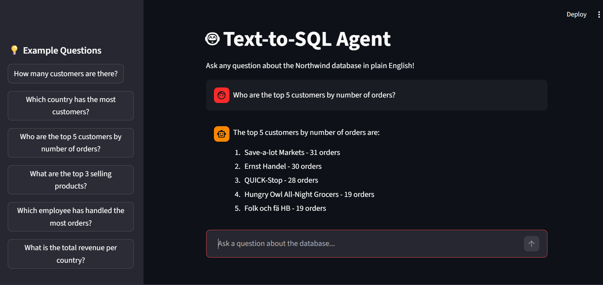

# 🤖 Text-to-SQL Agent
### Ask questions in plain English → Get answers from a real database


---

## 📌 What is this?

A **production-style Agentic AI application** that converts natural language questions into SQL queries and returns answers from a PostgreSQL database — without writing a single line of SQL.

> "How many orders were placed in 1997?" → Agent writes SQL → Queries database → Returns **"There were 408 orders placed in 1997"**

This project combines **Generative AI + Agentic AI + Data Engineering** in one end-to-end system.

---

### Chat Interface
<!-- Add your screenshot here -->
> 📷 *Replace this with your screenshot of the Streamlit UI*




---

## 🏗️ Architecture

```
User Question (Natural Language)
        │
        ▼
┌─────────────────┐
│  Streamlit UI   │  ← Frontend (frontend/app.py)
│  Chat Interface │
└────────┬────────┘
         │ HTTP POST /query
         ▼
┌─────────────────┐
│    FastAPI      │  ← REST API Backend (api/main.py)
│    Backend      │
└────────┬────────┘
         │
         ▼
┌─────────────────────────────────┐
│     LangChain SQL Agent         │  ← Core Agent (agent/sql_agent.py)
│                                 │
│  ReAct Loop:                    │
│  1. Inspect DB schema           │
│  2. Generate SQL query          │
│  3. Execute query               │
│  4. Self-correct if error       │
│  5. Return natural language ans │
└────────┬────────────────────────┘
         │
         ▼
┌─────────────────┐
│   PostgreSQL    │  ← Northwind Database (14 tables)
│   Northwind DB  │
└─────────────────┘
```

---

## ⚙️ Tech Stack

| Layer | Technology | Purpose |
|---|---|---|
| LLM | Llama 3.3 70B via Groq | Natural language understanding + SQL generation |
| Agent Framework | LangChain `create_sql_agent` | ReAct loop, tool use, self-correction |
| Database | PostgreSQL + Northwind | Real business data (customers, orders, products) |
| Backend | FastAPI + Uvicorn | REST API with auto Swagger docs |
| Frontend | Streamlit | Chat UI with example questions |
| ORM | SQLAlchemy | Database connection layer |

---

## 🧠 How the Agent Works (ReAct Loop)

Unlike a simple LLM call, this project uses a **LangChain SQL Agent** that reasons step by step:

```
User: "Who are the top 5 customers by number of orders?"

Step 1 → THOUGHT: I need to find customer order counts
Step 2 → ACTION: sql_db_list_tables → sees customers, orders tables  
Step 3 → ACTION: sql_db_schema → inspects table structure
Step 4 → ACTION: sql_db_query_checker → validates SQL before running
Step 5 → ACTION: sql_db_query → executes the query
Step 6 → OBSERVATION: gets results
Step 7 → ANSWER: "The top 5 customers by orders are..."
```

This is **Agentic AI** — the model autonomously decides which tools to use and self-corrects if SQL fails.

---

## 🚀 Getting Started

### Prerequisites
- Python 3.10+
- PostgreSQL installed
- Groq API key (free at [console.groq.com](https://console.groq.com))

### 1. Clone the repository
```bash
git clone https://github.com/yourusername/text-to-sql-agent.git
cd text-to-sql-agent
```

### 2. Create virtual environment
```bash
python -m venv venv
venv\Scripts\activate        # Windows
source venv/bin/activate     # Mac/Linux
```

### 3. Install dependencies
```bash
pip install -r requirements.txt
```

### 4. Set up environment variables
Create a `.env` file in the root folder:
```env
GROQ_API_KEY=your_groq_api_key_here
DB_USER=postgres
DB_PASSWORD=your_postgres_password
DB_HOST=localhost
DB_PORT=5432
DB_NAME=northwind
```

### 5. Load Northwind database
```bash
# Download from: https://github.com/pthom/northwind_psql
# Create 'northwind' database in pgAdmin
# Load the SQL dump via pgAdmin Query Tool
```

### 6. Run the FastAPI backend
```bash
uvicorn api.main:app --reload
```

### 7. Run the Streamlit frontend
```bash
streamlit run frontend/app.py
```

Open `http://localhost:8501` in your browser.

---

## 📂 Project Structure

```
text-to-sql-agent/
│
├── agent/
│   ├── __init__.py
│   └── sql_agent.py       # LangChain SQL Agent core logic
│
├── api/
│   ├── __init__.py
│   └── main.py            # FastAPI endpoints
│
├── frontend/
│   └── app.py             # Streamlit chat UI
│
├── screenshots/           # Add your screenshots here
├── .env                   # API keys and DB config (not committed)
├── .gitignore
├── requirements.txt
└── README.md
```

---

## 💬 Example Questions You Can Ask

| Question | What it demonstrates |
|---|---|
| "How many customers are there?" | Simple COUNT query |
| "Which country has the most customers?" | GROUP BY + ORDER BY |
| "Who are the top 5 customers by orders?" | JOIN + aggregation |
| "How many orders were placed in 1997?" | Date filtering |
| "Which employee handled the most orders?" | Multi-table JOIN |
| "What are the top 3 selling products?" | Complex aggregation |

---

## 🔑 Key Features

- **Natural Language to SQL** — no SQL knowledge needed by the user
- **Agentic ReAct Loop** — multi-step reasoning, not a single LLM call
- **Self-Correction** — agent fixes its own SQL errors automatically
- **REST API** — FastAPI backend with auto-generated Swagger docs
- **Chat Interface** — conversation history with example questions sidebar
- **Real Database** — Northwind PostgreSQL with 14 tables and real business data

---

## 🛠️ Future Improvements

- [ ] Add per-user authentication
- [ ] Stream responses in real time
- [ ] Show generated SQL in the UI (expandable)
- [ ] Deploy to Railway with hosted PostgreSQL
- [ ] Add query history and export to CSV
- [ ] Support multiple databases

---

## 👨‍💻 Author

**Atin Choudhary**  
[GitHub](https://github.com/AtinChoudhary06)

---

## 📄 License

MIT License — feel free to use this project for learning and interviews.
